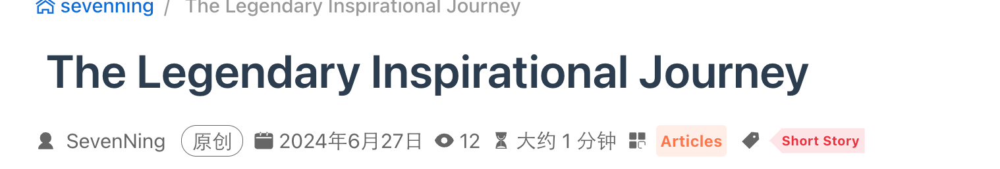

## 1.标题编写

::: md-demo 演示

# 标题一

## 标题二

### 标题三

#### 标题四

##### 标题五

###### 标题六


:::

## 2.代码块

::: md-demo 代码块添加语法

1. Markdown 语法

``` markdown
# 标题一

## 标题二

### 标题三

#### 标题四

##### 标题五

###### 标题六

```

2. Python 代码

```python
import random

number_to_guess = random.randint(1, 100)
guess_count = 0
max_tries = 10

print("猜数字游戏开始！尝试猜测一个在 1 到 100 之间的数字。你有 10 次机会。")

while guess_count < max_tries:
    guess_str = input("请输入你的猜测：")
    if not guess_str.isdigit():
        print("请输入一个有效数字！")
        continue
    guess = int(guess_str)
    guess_count += 1

    if guess < number_to_guess:
        print("太低了！再试一次。")
    elif guess > number_to_guess:
        print("太高了！再试一次。")
    else:
        print(f"恭喜！你猜对了数字 {number_to_guess}！你总共猜了 {guess_count} 次。")
        break
if guess != number_to_guess:
    print(f"很遗憾，你的机会已用完。正确的数字是 {number_to_guess}。")
```

3. Java 代码

```Java
public class HelloWorld {
    public static void main(String[] args) {
        // 输出 Hello Bornforthis 到控制台
        System.out.println("Hello, Bornforthis!");
    }
}
```

:::


## 3.链接🔗插入

::: md-demo 链接插入演示

`链接名称](链接)`


[Sevenning Code](https://www.sevenning.com)

:::


## 4.图片插入

::: md-demo 插入图片演示

:::


## 5.有序序列

:::md-demo 

1. 小明
2. 小红
3. 小飞
    1. 你好，我是七与宁
    2. 你好，我是威廉
    3. 你好，我是张远宁
4. 小王

:::

## 6.无序序列

::: md-demo

- 大中华地区
- 步行街
- 解放路

::: 

## 7.数学公式

### 7.1 基础演示

::: md-demo

$$xxx$$
$$
xxx
$$


可以通过在 `$` 字符之前使用 `\` 或在 `$` 字符前后添加空格来完成转义：

$a=1$ 是一个 TeX 方程，而 $ a=1 $ 和 \$a=1$ 不是。


:::

### 7.2 行内语法

::: md-demo

Euler's identity $e^{i\pi}+1=0$ is a beautiful formula in $\mathbb{R}^2$.

:::

### 7.3 显示语法

::: md-demo
$$
\frac {\partial^r} {\partial \omega^r} \left(\frac {y^{\omega}} {\omega}\right)
= \left(\frac {y^{\omega}} {\omega}\right) \left\{(\log y)^r + \sum_{i=1}^r \frac {(-1)^i r \cdots (r-i+1) (\log y)^{r-i}} {\omega^i} \right\}
$$
:::

- [Tex教程](https://www.overleaf.com/learn/latex/Learn_LaTeX_in_30_minutes)
- [Tex速查表](https://mdit-plugins.github.io/zh/tex.html#tex-tutorial)

## 8. 任务列表

::: md-demo

- [x] 计划A
- [x] 计划B
- [x] 计划C

:::

## 9.选项卡

:::: md-demo

::: tabs

@tab 教学

脱掉裤子👖放屁💨

@tab 实操

放了，多此一举。

:::

---

::: tabs#travel

@tab 计划A#北京

去北京

@tab 计划B#上海

去上海

:::

---

::: tabs#travel

@tab 北京

- 天安门
- 朝阳区
- 人民大会堂

@tab 上海

- 上海滩
- 东方明珠

:::

::::

## 10. 代码块分组

:::: md-demo

:::code-tabs

@tab 代码 1

```python
print('hello sevenning')
```

@tab 代码 2

```python
a=1
b=1
print(a+b)
```

@tab 代码 3

```python
a=b=1
print(a)
print(b)
```

:::

---

::: code-tabs#shell

@tab Python

```python
a,b,c = 1,2,3
print(a,b,c)
```

@tab pnpm

```python
pnpm add -D vuepress-theme-hope
```

:::

---

::: code-tabs#shell

@tab Python

```python
print(a,b,c)
```

@tab pnpm

```python
pnpm add -D xuepress-theme-hope
```

:::

::::

---

## 11. 行内代码

::: md-demo

pnpm install xxxx

`pnpm install xxxx`

:::

## 12. 提示容器

:::: md-demo

::: important

重要容器。

:::

::: info

信息容器

:::

::: note

注释容器

:::

::: tip

提示容器

:::
::: warning

警告容器

:::

::: caution

危险容器

:::

::: details

详情容器

:::

::::


## 13. 标记

::: md-demo

你好，==William==。

:::


## 14. 剧透

::: md-demo

你好，!!William!!

:::

## 15. 自定义对齐

:::: md-demo

::: left

左对齐的内容

:::

::: center

居中的内容

:::

::: right

右对齐的内容

:::

::: justify

两端对齐的内容

:::

::::

---

:::: caution  W.I.P

Vuepress Theme Hope V2 版本仍在制作中，API可能会有

::: center

重大的变动

:::

如果你在使用过程中遇到了bug，可以

::: right


:::

::::


## 16. 文章加密

文件: `theme.ts`

```typescript
```

